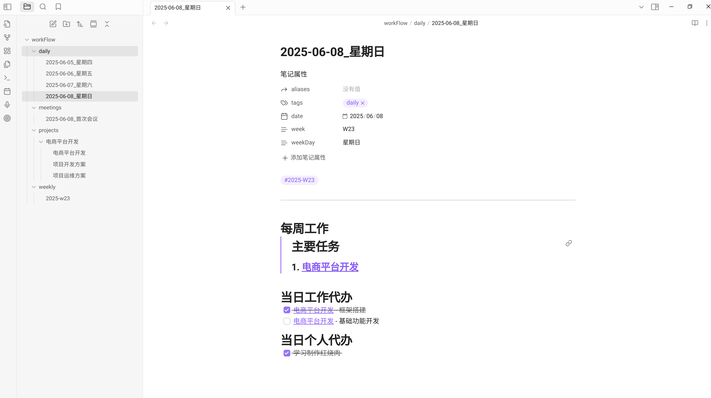
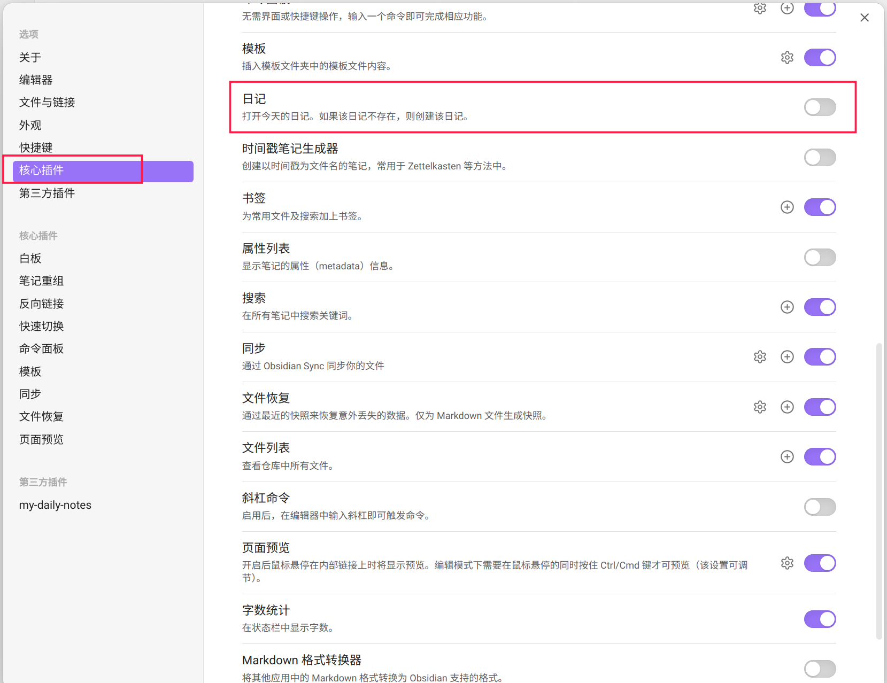

# smooth-daily
smooth-daily 这是一款能够流畅地管理各种任务的Obsidian插件。主要包含了五个模块：每日代办、每周任务、项目和会议记录。

## 插件功能预览

## 安装

## 使用说明
目前插件已经提交社区审核, 还不能通过社区插件市场安装,请参考下方的手动安装方式:

1. 使用Obsidian新建一个专用于管理您任务的笔记仓库；
2. 进入`仓库所在路径/.obsidian/plugins/`目录下，创建插件目录`SmoothDaliy`；
3. 打开本项目的[release页面](https://github.com/dorlolo/smooth-daily/releases)，下载最新的`main.js, manifest.json, styles.css`文件，存放到`SmoothDaliy`目录下；
4. 重启Obsidian并在设置选项的第三方插件中找到`SmoothDaliy`插件并启用。

## 插件说明

这是一个Obsidian插件，用于管理日记、周记、项目和会议记录。以下是它的主要功能：
- 启用插件时自动生成当天的日记文件
- 昨日未完成的任务会自动添加到当天日记中
- 日记、周记、项目、会议都支持自定义模板
- 提供了一些快捷按钮和命令，方便快速创建日记、周记、项目、会议内容

## 注释事项
- 使用前请先禁用官方的日记插件
