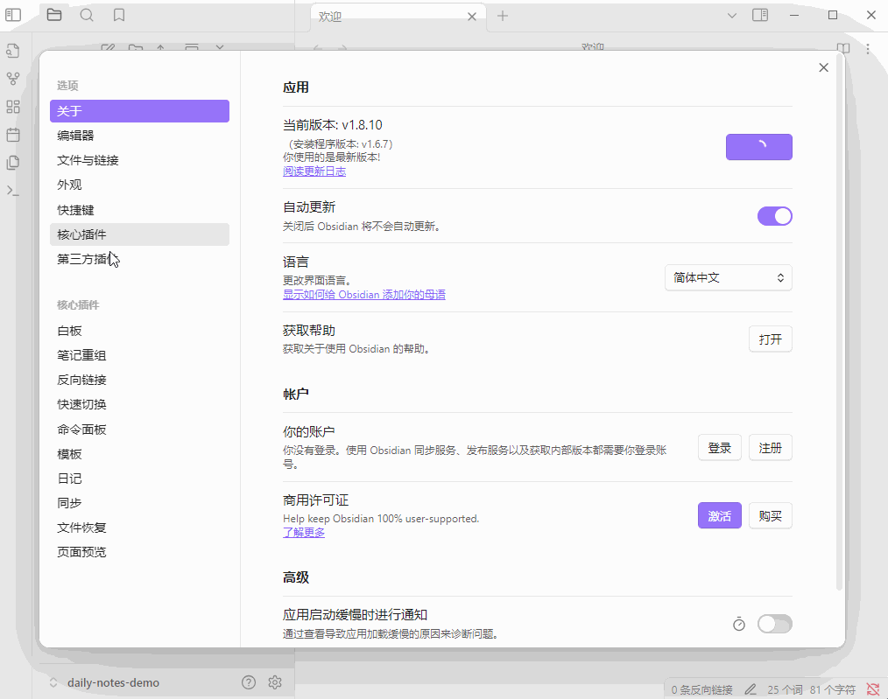
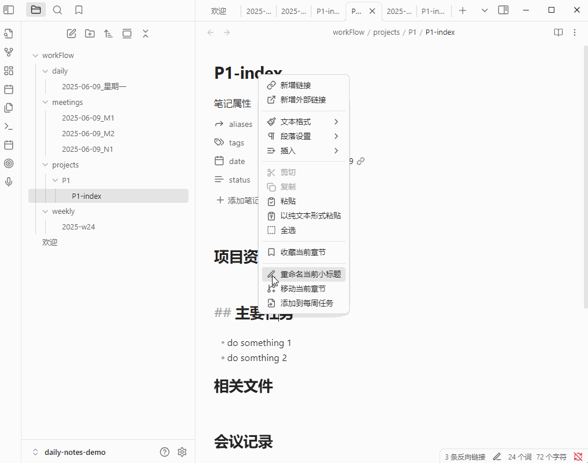

# smooth-daily
smooth-daily 这是一款能够流畅地管理各种任务的Obsidian插件。主要包含了五个模块：每日代办、每周任务、项目和会议记录。

## 页面预览

## 安装

目前插件已经提交社区审核, 还不能通过插件市场安装,请参考下方的手动安装方式:

1. 使用Obsidian新建一个专用于管理您任务的笔记仓库；
2. 进入`仓库所在路径/.obsidian/plugins/`目录下，创建插件目录`SmoothDaliy`；
3. 打开本项目的[release页面](https://github.com/dorlolo/smooth-daily/releases)，下载最新的`main.js, manifest.json, styles.css`文件，存放到`SmoothDaliy`目录下；
4. 重启Obsidian并在设置选项的第三方插件中找到`SmoothDaliy`插件并启用。

## 使用说明

### 启用插件

当插件被启用时，会自动生成当天的代办和每周任务文件。

此外，为了更好的使用体验。建议禁用官方的日记插件

### 创建日记

点击`创建日记`按钮，会生成一个日记文件。并且会继承上一次未完成的任务。

### 创建项目

点击`创建项目`按钮，会自动生成一个项目视图文件。

### 将项目添加到每周任务中

### 将文件标题添加到每周任务中

### 为项目创建会议记录

### 创建无关联的会议记录

